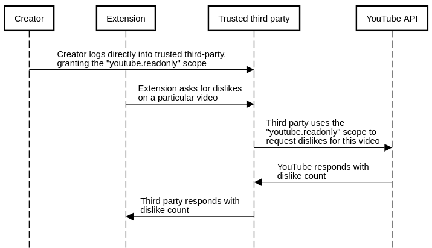
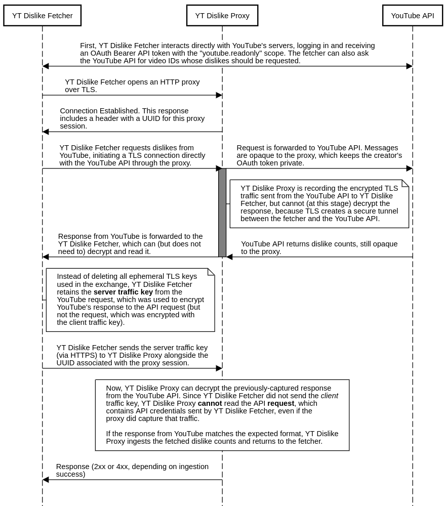

> Note: This repository, though functional for the described purpose, is not quite in a finished state. The sister repository, in particular, doesn't record the fetched information in any way other than by logging it to the console. I think this was a classic case of "I did the fun hard part and then the easy tedious bits were too boring", mixed with "holy crap my life is taking a bunch of crazy turns very quickly and this project is not on my radar anymore". I'm leaving the repository in its current state for posterity, but I'm definitely not ready to guarantee that any of this will work how I say it does! In particular, it probably still needs a more thorough security audit and more work done to make sure the code in this repository especially is very easy to read.

> I also haven't implemented any of the code to make the proxy server work more than once; in its final form, the server would distribute UUIDs when the proxy session opens that could be used to associate a `/key` request with the appropriate proxy session.

# YT Dislike Fetcher

Allows creators to self-host their dislike-fetching code in a way that makes it impractical for creators to tamper with results from the YouTube API. Works in tandem with [YT Dislike Proxy](https://github.com/SyntaxBlitz/yt-dislike-proxy).

## Background

YouTube recently removed the dislike counter. This has made a lot of people very angry and has been widely regarded as a bad move[.](https://www.goodreads.com/quotes/1-the-story-so-far-in-the-beginning-the-universe-was)

Content creators are still able to access their own dislike counts through the [YouTube API](https://developers.google.com/youtube/analytics/reference/reports/query), so [browser extension authors](https://github.com/Anarios/return-youtube-dislike) hold out hope that we can still show true dislike counts (probably with a bit of a lag) for creators who are on board. If creators use OAuth to sign into an application run by the extension author, granting the permissions associated with the `youtube.readonly` scope, the extension author will be able to fetch dislike counts for that creator's videos.

But [creators are wary](https://www.youtube.com/watch?v=Nz9b0oJw69I) about granting the `youtube.readonly` scope to extension authors, because it would enable extension authors to fetch more than just dislike counts. It's not an especially broad scope, but it would still give extension authors access to some data that creators would rather keep private.

The natural solution is for creators to self-host the dislike fetcher script, running their own code (or well-audited code) on their own computers to fetch dislike counts and then sending those dislike counts off to extension authors. This way, extension authors don't have the permissions associated with the `youtube.readonly` OAuth scope; they would only have access to data sent directly to them by creators.

But this just inverts the trust, requiring extension authors to believe creators' self-reported dislike counts. We're at an impasse!

That's what this repository is designed to solve. The next section of this README is about various other approaches to the problem, but if you want to understand this solution directly, you can skip this section.

## Potential approaches

The [Return YouTube Dislike](https://returnyoutubedislike.com/) community has proposed a few solutions to this problem, which I've summarized briefly here. Most related discussion has happened in the [Discord server](https://discord.gg/mYnESY4Md5). Some discussion has also taken place in GitHub issues.

### Non-starters


**Ask YouTube to add a narrower scope**  
The "correct" solution to this problem would be to ask YouTube to add a narrower OAuth scope that allows authorized applications to request *just* dislike data. To my knowledge, no one has actually asked, but presumably they wouldn't do this for us (since the whole point of the project is to subvert YouTube's will). Still, I included this "solution" here for completeness, since it's the "correct" theoretical solution to this problem. The point of OAuth scopes is to let users give applications limited access to their data. The problem is just that the access isn't limited enough in this case.

**Use crypto magic to prove that the response truly came from YouTube**  
If we could prove that a particular API response came from YouTube, then creators could self-host the dislike-fetching code without being able to tamper with the results. This is theoretically possible with asymmetric cryptography, but it would require the YouTube API to implement some such authentication mechanism. To my knowledge, YouTube doesn't have anything like this implemented (though it's possible there's something I've missed).

YouTube's servers *do* use one implementation of asymmetric cryptography that can be used to validate their authenticity: TLS! If every response from YouTube's API servers were signed with YouTube's certificate private key, we could verify that signature against YouTube's public certificate to prove the response's authenticity.

Unfortunately, that's not how TLS works. Alhough the initial *handshake* makes use of asymmetric cryptography so that the server can prove that it's a real YouTube server, the actual application data (HTTP request and response) is encrypted using *symmetric* cryptography, meaning the client and server both have the ablity to encrypt and decrypt messages. So even if creators sent the extension author full logs of their TLS-protected interactions with YouTube's server, although it would be possible to verify that *some* interaction with YouTube had occurred, it would not be possible to authenticate the contents of YouTube's response, because the creator would have been able to tamper with the response before sending it to the extension author.

This doesn't rule out TLS trickery, though. It just makes things a little bit harder. Stay tuned.

### Finding trust somewhere else

One oft-proposed solution is to use a mutually-trusted third party to handle dislike-count requests. That might look something like this:



In this case, we assume the creator trusts the third party not to misuse the `youtube.readonly` scope by requesting anything other than dislike counts. The extension also trusts the third party not to forge dislike counts.

This is a practical solution, but finding a trusted third party who would be willing to run this service might be difficult, especially since their reputation would be at stake if anything went wrong. Likely candidates for such a third party could be well-trusted content creators like [LMG](https://linusmediagroup.com/), but this seems like it's likely too much to ask.

### Using auditable infrastructure

The problem with letting extension authors directly host the dislike-fetcher application is that, even if the application is open-source, the deployment could be maliciously altered to request more than just dislike counts using the `youtube.readonly` scope; this is the source of creator wariness.

One solution to this problem would be to make deployments completely transparent so that especially paranoid creators can manually verify the infrastructure and look at what code is being run on the server they're logging into. The specifics of this could get a little hairy, but it would be possible by (for example) hosting a fetcher web application in AWS using Lambda and API Gateway and giving creators read-only accounts that would let them verify that the service's domain name is linked to a Lambda serving auditable code. The service would store some secret data used to authenticate itself with the extension author's database, but otherwise its source code would be publicly viewable.

One problem with this solution is that it assumes creators would audit the code every time they want to update their dislike count (otherwise, the deployment's code might change to start misusing OAuth tokens). This auditing is an automatable process (assuming the audited code doesn't change), but it does introduce a race condition, since of course the code might change in between an audit and an actual dislike-fetch action.

This solution also requires creators to log into the site every time they want to update dislike counts, because it would be impossible (or at least very difficult) for the fetcher service to store OAuth refresh tokens without making these tokens accessible to a malicious extension author, should the author change the deployment after the fact to access the stored data.

It's worth noting that this solution *does* involve trust; creators would have to trust the AWS dashboard (or whoever is hosting the infrastructure) when it shows the code associated with a deployment. But this seems like a pretty reasonable trade.

## This repository

This project (hosted across two separate repositories; here and in the related [YT Dislike Proxy](https://github.com/SyntaxBlitz/yt-dislike-proxy) repository) aims to solve the problem by letting creators self-host the fetcher web application (so that they have full control over which requests are sent to the YouTube server, fetching only dislike counts from the YouTube API) while maintaining a reasonable degree of certainty that the responses from YouTube have not been tampered with.

The trick is to require the creator to proxy their requests to the YouTube API through a server controlled by the extension author. As long as the requests are made using TLS, this is secure for the creator, for the same reason that HTTPS protects people using café WiFi. Although the TCP packets are being routed through the extension author's server (which is running the YT Dislike Proxy application), TLS creates a secure tunnel between the creator-controlled fetcher and the YouTube API that prevents tampering and also protects the creator's OAuth token (which can be used to make any requests permitted by the authorized `youtube.readonly` scope). Thus, the creator need not trust the extension author.

So then how does YT Dislike Proxy see the dislike count returned by the YouTube API? The (second) trick is, *after* the fetcher-YouTube interaction is over, the fetcher saves the key used to encrypt the response from the YouTube API and sends this key to YT Dislike Proxy. Now, the proxy can decrypt that server response to observe the dislike count. Critically, TLS uses *different keys* to encrypt client and server traffic, so even though the proxy will have access to the server key, it won't be able to read the *request* made to the YouTube API, just the response. This keeps creators' OAuth credentials safe even against a malicious proxy. The client and server key are both [derived from a master key](https://datatracker.ietf.org/doc/html/rfc8446#section-7.1), but they cannot be used to derive each other. As long as the fetcher only sends the server traffic key (and not the client traffic key or the master key), only YouTube's response will be accessible to the proxy.

See the sequence diagram below for details:



With this approach, creators no longer need to trust the extension author's servers, because creators are in full control of the dislike fetcher software, which they can run on their own infrastructure (or on their personal computers). This means creators can control exactly what requests they make to the YouTube API instead of trusting anyone else with the full capabilities of the `youtube.readonly` scope. Only the response to creator-initiated requests will be shared with the extension author's proxy server, and these responses contain no information other than the video dislike counts.

The proxy can be confident that the response truly came from the YouTube API, because this server personally interacted with YouTube's servers. In the simpler creator-hosted-fetcher solution described in the "Potential approaches" section, creators would have self-reported their dislike counts, which made it easy for them to lie. But in this case, encrypted dislike counts are fetched directly from YouTube to the proxy server (and subsequently decrypted, once the proxy has the server traffic key) rather than being routed through the creator's computer.

## Caveats

There are a few caveats to this approach:

We assume that the entire YouTube API response contains no sensitive information. This should be a safe assumption, because the creator-controlled fetcher application has full control over the request (and we can see by inspection that responses don't, for example, contain OAuth credentials). More importantly, the fetcher application has a chance to inspect the response before sending the decryption key to the proxy, so an intelligent fetcher application could refuse to send the decryption key if the response doesn't match the expected format. This proof-of-concept repository doesn't implement any such verification, but it could be added in future iterations (or added in a fork, since creators can run any version of the fetcher they want) in case YouTube's API changes its response format to include anything sensitive.

Although the proxy server is making direct requests to the YouTube API, which offers high confidence that the responses are really from YouTube, there is no *cryptographic* proof that the response is actually from YouTube's servers. In theory, if a creator had the ability to act as a [MITM](https://en.wikipedia.org/wiki/Man-in-the-middle_attack) between the proxy and YouTube's servers, they would be able to modify dislike counts using the server traffic key and convince the extension author that the dislike counts came from YouTube's servers. This risk is comparable to the risk of an insecure HTTP-only website having its contents modified in-flight, something that is possible at the ISP/government level but which is vanishingly unlikely in these circumstances, since the specific fetcher making the request would need to be able to act as a MITM between the extension author's server infrastructure and YouTube's servers. This issue does not put creators at risk; it just makes it theoretically possible for dislike counts to be falsified by creators.

One caveat involves response formats. Since the proxy is unable to read the request sent to the YouTube server, it's important that the response be interpretable even in the absence of information about the request. Fortunately, YouTube's response format contains a lot of metadata:

```
{
  "kind": "youtubeAnalytics#resultTable",
  "columnHeaders": [
    {
      "name": "video",
      "columnType": "DIMENSION",
      "dataType": "STRING"
    },
    {
      "name": "dislikes",
      "columnType": "METRIC",
      "dataType": "INTEGER"
    }
  ],
  "rows": [
    [
      "9ird5THhosY",
      13
    ]
  ]
}
```

Because of this, it's not possible for creators to, say, trick the proxy into thinking that the returned number is for a metric other than dislikes, or that the returned number is for a different video than the one requested. YouTube will not return a result at all for videos that are not owned by the user.

But there are still a few ways to trick the proxy. For example, it's possible to request dislikes only from a particular timeframe instead of from the entire lifetime of the video, and this won't be apparent just from the responsee. This can be solved in a few ways (by having YouTube include additional information in the response), but these additional validations are outside the scope of this proof-of-concept.

One last caveat is that, at least at the moment, YT Dislike Proxy has very particular expectations for how the request is made (it requires TLS 1.3 over HTTP/1.1 using the TLS_AES_256_GCM_SHA384 cipher suite, since that's what YouTube's servers picked in my testing). The code knows just enough about TLS to get the job done, but there are certain aspects of TLS that would not be decrypted correctly by the proxy simply because it looks like the YouTube API doesn't use those, and it wasn't worth figuring them out for the sake of a proof-of-concept. This doesn't affect any security guarantees (for the creator or for the extension author), but it does mean that if YouTube makes any changes to their TLS configuration, it's possible that the proxy will stop correctly decrypting TLS responses and will need to be repaired.

## Real-world use

This solution supports varied levels of paranoia on the creator side. Although the YT Dislike Proxy is run on a server trusted by the extension author (and not necessarily trusted by the creator), the YT Dislike Fetcher (this repository) can be run on any infrastructure trusted by the creator (even outside the trust radius of the extension author).

But it's not necessary for the creator to self-host the fetcher application. The extension author can host both the YT Dislike Fetcher and the YT Dislike Proxy, and creators who trust the extension author can just log directly into the extension-author-hosted fetcher application. This would give the extension author full access to the `youtube.readonly` scope (trusting the extension author not to misuse this access), but it would make things especially simple for creators.

Unfortunately, YouTube limits API calls per application to 10,000 per day, and I've been told the limit on the number of videos whose dislikes can be fetched in a single request is 50; this puts a theoretical maximum of 500,000 fetches per day for a single instance of the fetcher, though the true number would be lower, since each individual request is limited to fetching dislikes for a single creator. This would cause problems for a centrally-hosted version of the fetcher application if it's unable to receive a quota increase from YouTube (it's hard to say whether this would be feasible).

Creators can also download this repository, read through the code, create an application in the Google Console, and configure and host the fetcher for themselves, which enables them to verify that their OAuth login is only being used in ways they've consented to. Since this setup doesn't require the fetcher application to be trusted by the extension author, there's no trust required in this situation.

A middle ground is also achievable. Anyone can host the fetcher application, as long as creators are comfortable logging into it. So, if one savvy creator wants to self-host the application, that creator could share the link with other creator friends who don't have the skillset to audit and host the web application themselves.

Currently, this proof-of-concept fetcher requires creators to log into the application every time they want to refresh dislike counts. A more advanced fetcher could store an OAuth refresh token so that requests could be made periodically, keeping counts up-to-date. Because the creator-trusted fetcher is the one holding application credentials, the onus is on the fetcher software to make periodic requests to keep the extension database updated. I am open to implementing this behavior in this repository if RYD chooses to move forward with this approach, but for now it remains unimplemented.

The fetcher also currently only fetches dislikes for public videos, not private, unpublished, or unlisted videos, since offering dislike counts for unlisted videos would leak those video IDs to the extension author's servers. This is already happening, of course, if anyone with the extension installed views the video, but for now I've opted for the most privacy-respecting solution. In the future, the fetcher could offer additional options to let creators choose which videos have their dislike counts uploaded.

## Auditability

> Note: since this repository is still a proof-of-concept, this section might not reflect the current state of the repository. What I describe here is the ideal state.

A primary objective of this repository (YT Dislike Fetcher) is to keep the code as simple and easy to read as possible. I have worked to eliminate unnecessary dependencies and make sure there are no sneaky places where untrustworthy code might be hidden. The YT Dislike Proxy code doesn't have quite as much care put into it, since that code need not be trusted by creators, but I've still tried to make it at least readable enough that it wouldn't need to be wholly rewritten if an extension author chose to use it in its current state. It's similarly important to me that updates not be made to the master branch of this repository unless they're essential, because each update means another audit for each person using the application.

This repository is also meant to work out of the box, so that anyone who has read the code and deemed it trustworthy is able to host an instance for themselves. Self-hosting gives creators agency in their data uploads, so I want to reduce the friction as much as possible.

There is one MOTD ("message of the day") box shown on the fetcher's sign-in screen so that the proxy server can provide any updates to users of fetcher software (especially outdated fetcher software). Other than that, the fetcher doesn't include any remote resources in the web application, to ensure that everything displayed to the user (and all code run in the web application) is under control of whoever is hosting the fetcher application. I have taken care to ensure that the MOTD is not susceptible to XSS; the proxy server owner is only able to provide some raw text that will be shown to users.

## License

This repository (and the YT Dislike Proxy repository) is available under the MIT license. This should be permissive enough, but feel free to contact me if you'd like to use this code without attribution and I'll try to work something out.
